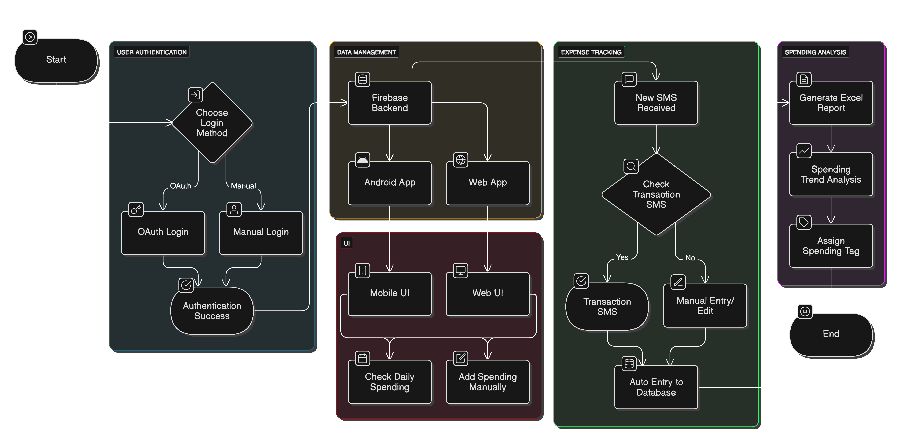

# ArthMitra Project Report

### Project Video

### WorkFlow Diagram

## Chapter 1: Introductions

### Background
ArthMitra is a financial management application designed to help users track their expenses, analyze their spending patterns, and receive personalized financial advice. The name "ArthMitra" combines "Arth" (meaning wealth or finance in Sanskrit) and "Mitra" (meaning friend), positioning the application as a friendly financial assistant. In today's fast-paced world, managing personal finances effectively has become increasingly challenging, and ArthMitra aims to address this need through an intuitive mobile application enhanced with AI capabilities.

### Problem Statement
Many individuals struggle with tracking their expenses, understanding their spending patterns, and making informed financial decisions. Traditional banking apps often lack personalized insights and financial education components. Additionally, manually recording transactions is time-consuming and prone to errors. There is a need for an automated, intelligent financial management solution that can extract transaction data from SMS notifications, categorize expenses, provide actionable insights, and offer personalized financial advice.

### Objectives
- Develop a user-friendly mobile application for tracking income and expenses
- Implement automated SMS scanning to extract financial transaction data
- Create an AI-powered chatbot for personalized financial advice
- Provide visual analytics and insights on spending patterns
- Ensure secure authentication and data privacy
- Deliver a responsive design that works across different device sizes

### Scope of the Project
- User authentication and profile management
- Manual and automated transaction recording
- Transaction categorization and management
- Financial insights and analytics dashboard
- AI-powered financial assistant chatbot
- SMS scanning for transaction extraction
- Cross-platform compatibility (iOS, Android, web)
### Please Continue By reading the full project report in forReadme/ArthMitra, Your Personalized Financial Khata.pdf
